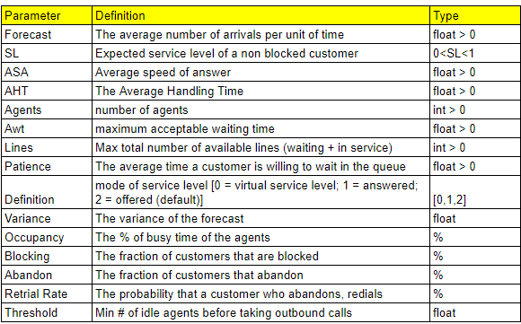

```{r setup, include=FALSE}
knitr::opts_chunk$set(echo = TRUE)
```


```{r, echo=F, include=FALSE}

setwd("C:\\Users\\Tesfahun Boshe\\Documents\\WFM\\Erlang")
```


# Introduction


I was lucky to get the Python version of Erlang calculators from CCMath. In this article I will try to share my experience with it. But first some introduction to the queueing models they included: Erlang C,Erlang X,Erlang Chat and Erlang Blended. 

## Queueing Models

**Erlang C** is one of the two [Erlang B, Erlang C] calls-traffic modeling formulae developed by Danish mathematician A.K. Erlang in 1917. Unlike Erlang B, Erlang C Erlang C formula provides for the possibility of an unlimited queue and it gives the probability that a new call will need to wait in the queue due to all servers being in use. *Erlang* is, therefore, the SI unit of telephone traffic. It defines the relationship among the call volume, average handling time, service level, average wait time and the number of agents. 

**Erlang X** is an extension of Erlang C which adds the number of available lines, the average customers' patience, the probability of retrial after abandoning the call  and variance in arrival volume into consideration. 

**Erlang Chat** models chats-traffic. The major difference here is an issue of concurrency; agents can handle multiple chats in parallel. Many major chat service software solutions allow a chat concurrency of more than 1, which is impossible in the case of phone calls. An alternative way sometimes used to model chat-traffic is to use Erlang C or X and assume a lower volume (i,e lower by a factor of the average concurrency)

**Erlang Blend** models the scenarios where agents will work on inbound as well as outbound calls.If an agent becomes available, they will prioritize inbound calls and will only take on outbound calls when other agents are left idle. It, therefore,assumes one additional parameter: *Threshold*. Threshold is the minimum number of agents to be left idle before the first person is allowed to take outbound work.


## Parameters

Here is the short summary of parameters across the models. 


# Data and calculations

## Data

For the testing purpose, I have prepared a completely random 1-day long hourly arrival volume of phone contacts. The demo file has examples for single data points, but I know most people will have much longer per-interval data points on which they need to evaluate the functions. These examples should be more handy therefore. 

There is a very common bad practice among WFM community of calculating the Weekly or even monthly FTE's from a single data points. It is significantly less work but  only as accurate as a simple average can get. In other words, you will be understaffed for half of the time and overstaffed for the other half. A better practice would be to define the arrival pattern from the historical data and then to convert weekly/monthly volume to smaller intervals before FTE calculations. 

Let's import the necessary libraries. 

```{r, echo = F, messages = F, warnings = F}
library(reticulate)
use_python("C:/Users/Tesfahun Boshe/AppData/Local/Programs/Python/Python310/python.exe")


```

```{python}
import pandas as pd
import numpy as np
import requests
import ERLANG # ERLANG.py file you get from CCMath should be in the same working directory. Rename it here if yours has a different name. 

```


```{python}

# Data
df = pd.read_csv('erlangTest.csv')
df.head(24)

# AHT, AWT, ASA in seconds
# Forecast - expected volume in 1 second
```

It is important to note that the forecast volume represents the average volume in a unit time. If your AHT, AWT, ASA values are in seconds, your forecast volume should be the expected average within 1 second. If those numbers are in minute, like wise. 


```{python, echo = F, messages = F, warnings = F}

# Define each column as a list
# This is because the functions in ERLANG module are defined like that. 

Forecast = df['Forecast'].tolist()
AHT = df['AHT'].tolist()
AWT = df['AWT'].tolist()
SL = df['SL'].tolist()

```

## 1. Erlang C

Erlang X functions with the default value of *Null* for *Lines*, *Patience*, *Variance*, *Retrial* variables are defined the same way as their C equivalents.

The following 3 functions showcase different input and output combinations. 

| Input                        | Output                | Function          |
|------------------------------|:---------------------:|------------------:|
| Forecast,AHT,Agents,AWT      | ASA, SL,Occupancy     | calc_option0_C    |
| SL,Forecast,AHT,AWT          | Agents, ASA, Occupancy| calc_option1_C    |
| ASA,Forecast,AHT,AWT         | Agents, SL,Occupancy  | calc_option2_C    |


```{python}

# calculates ASA, SL,Occupancy from Forecast,AHT,Agents,AWT
def calc_option0_C(Forecast,AHT,Agents,AWT):
  ASA = list(map(ERLANG.X.ASA,Forecast, AHT, Agents))
  SL = list(map(ERLANG.X.SLA,Forecast, AHT, Agents,AWT))
  Occupancy = list(np.array(Forecast)*np.array(AHT)/np.array(Agents))
  return(pd.DataFrame(list(zip(Forecast,AHT,Agents,AWT,ASA, SL,Occupancy)), columns =["Forecast","AHT","Agents","AWT","ASA", "SL","Occupancy"]))

# Agents, ASA, Occupancy from SL,Forecast,AHT,AWT
def calc_option1_C(SL,Forecast,AHT,AWT):
  Agents = list(map(ERLANG.X.AGENTS_SLA,SL,Forecast, AHT, AWT))
  ASA = list(map(ERLANG.X.ASA,Forecast, AHT, Agents))
  Occupancy = list(np.array(Forecast)*np.array(AHT)/np.array(Agents))
  return(pd.DataFrame(list(zip(SL,Forecast,AHT,AWT,Agents, ASA, Occupancy)), columns =["SL","Forecast","AHT","AWT","Agents", "ASA","Occupancy"]))

# Agents, SL,Occupancy from ASA,Forecast,AHT,AWT
def calc_option2_C(ASA,Forecast,AHT,AWT):
  Agents = list(map(ERLANG.X.AGENTS_ASA,ASA,Forecast, AHT))
  SL = list(map(ERLANG.X.SLA,Forecast, AHT, Agents,AWT))
  Occupancy = list(np.array(Forecast)*np.array(AHT)/np.array(Agents))
  return(pd.DataFrame(list(zip(ASA,Forecast,AHT,AWT,Agents, SL,Occupancy)), columns =["ASA","Forecast","AHT","AWT","Agents", "SL","Occupancy"]))
  
```

**Calling The Functions**

Since our test data *df* has SL,Forecast,AHT, and AWT, we will need *calc_option1_C* to calculate *Agents*,*ASA*,*Occupancy*. 

```{python}
# Scenario 0

df1 = calc_option1_C(SL,Forecast,AHT,AWT)
df1.head()

# df1.to_csv('calc_option1.csv', index = False) # uncomment to save to a csv file

```

Now that we have '*Agents*' in '*df1*' dataframe, we can use '*calc_option0_C*' to find ASA, SL, Occupancy values and compare them to initially assumed. 
```{python}
# Scenario 1

Forecast = df1['Forecast'].tolist()
AHT = df1['AHT'].tolist()
Agents = df1['Agents'].tolist()
AWT = df1['AWT'].tolist()


df0 = calc_option0_C(Forecast,AHT,Agents,AWT)
df0.to_csv('calc_option0.csv', index = False) # uncomment to save to a csv file
df0.head()
```

> The calculated values are almost exactly the same to the initially assumed as we would wisht.

Next, Let's use *calc_option2_C* and compare the outputs to the output/input of the others. 
```{python}
# Scenario 2

ASA = df0['ASA'].tolist()
Forecast = df0['Forecast'].tolist()
AHT = df0['AHT'].tolist()
Awt = df0['AWT'].tolist()

df2 = calc_option2_C(ASA,Forecast,AHT,Awt)
df2.to_csv('calc_option2.csv', index = False) # uncomment to save to a csv file
df2.head()

```
> Very similar once again! 

## 2. Erlang X

Erlang X calculator adds assumptions such as *Lines*, *Patience*, *Retrials*,*Definition* to the basic Erlang C calculator.

**Lines** Parameter defines the the limit on the total number of customers that can be in the system at the same time. This of course depends on capacity of telephony provider.A good practice, according to CCMath, is to set the default 'Lines' at 5 X top interval arrival. 

**Patience** is the average time a customer waits in the queue before abandoning. The CCMath comment says that it can be calculated by dividing the total waiting time (including the waiting times of the abandoned customers) by the number of abandonments. I don't see why we should divide the total waiting time by the number of abandoned calls only. It would make more sense if we divided the total wait time of abandoned calls by the total count of them. 


Like in the case of Erlang C, we have 3 use cases depending on the input parameters we have and the desired output. 

| Input                                         | Output                | Function          |
|-----------------------------------------------|:---------------------:|------------------:|
| Forecast,AHT,Agents,AWT, Lines, Patience      | ASA, SL,Occupancy     | calc_option0_X    |
| SL, Forecast, AHT, AWT, Lines, Patience       | Agents, ASA, Occupancy| calc_option1_X    |
| Abandon, Forecast, AHT, Lines, AWT,Patience   | Agents, SL,Occupancy  | calc_option2_X    |


```{python}

def calc_option0_X(Forecast,AHT,Agents,AWT, Lines, Patience):
  ASA = list(map(ERLANG.X.ASA,Forecast, AHT, Agents, Lines, Patience,0))
  SL = list(map(ERLANG.X.SLA,Forecast, AHT, Agents, AWT, Lines, Patience, 0))
  Abandon = list(map(ERLANG.X.ABANDON,Forecast, AHT, Agents, Lines, Patience, 0))
  return(pd.DataFrame(list(zip(Forecast,AHT,Agents,AWT, Lines, Patience,ASA,SL,Abandon)), columns =["Forecast","AHT","Agents","AWT", "Lines", "Patience","ASA","SL","Abandon"]))


def calc_option1_X(SL, Forecast, AHT, AWT, Lines, Patience):
  Agents = list(map(ERLANG.X.AGENTS_SLA,SL, Forecast, AHT, AWT, Lines, Patience, [0] * 24))
  ASA = list(map(ERLANG.X.ASA,Forecast, AHT, Agents, Lines, Patience, [0] * 24))
  Abandon = list(map(ERLANG.X.ABANDON,Forecast, AHT, Agents, Lines, Patience, [0] * 24))
  return(pd.DataFrame(list(zip(SL,Forecast,AHT,AWT, Lines, Patience,Agents, ASA, Abandon)), columns =["SL","Forecast","AHT","AWT", "Lines", "Patience","Agents", "ASA","Abandon"]))

def calc_option2_X(Abandon, Forecast, AHT, Lines, AWT,Patience):
  Agents = list(map(ERLANG.X.AGENTS_ABANDON,Abandon, Forecast, AHT, Lines, AWT, 0))
  ASA = list(map(ERLANG.X.ASA,Forecast, AHT, Agents, Lines, Patience, 0))
  SL = list(map(ERLANG.X.SLA,Forecast, AHT, Agents, AWT, Lines, Patience, 0))
  return(pd.DataFrame(list(zip(Abandon, Forecast, AHT, Lines, AWT,Patience, Agents,ASA, SL)), columns =["Abandon", "Forecast", "AHT", "Lines", "AWT","Patience", "Agents","ASA", "SL"]))
  
```

To see some example function calls. We will first fix the missing parameters. 

```{python}

df['Lines'] = 100 # max number of customers at a time
df['Patience'] = 120 # seconds
df['Retrial'] = 0.2 # probability of retrial
df['Definition'] = 2; # default - SL on offered calls
```

```{python, echo=F, include=FALSE}

Forecast = df['Forecast'].tolist()
AHT = df['AHT'].tolist()
AWT = df['AWT'].tolist()
SL = df['SL'].tolist()
Lines = df['Lines'].tolist()
Patience = df['Patience'].tolist()
Retrial = df['Retrial'].tolist()
Definition = df['Definition'].tolist()
```

```{python}

df1X = calc_option1_X(SL, Forecast, AHT, AWT, Lines, Patience)
df1X.head()

```

To compare against the output for Erlang C,

```{python}
df1.head()

```
Similarly we can call the other functions. 
```{python,eval=FALSE}
df0X = calc_option0_X(Forecast,AHT,Agents,AWT, Lines, Patience)
df2X = calc_option2_X(Abandon, Forecast, AHT, Lines, AWT,Patience)

```


## 3. Erlang Chat
Modeling chat contacts with maximum concurrency of 1 is the same problem as Modeling phone contacts. In such cases, we can use either Erlang C or Erlang C X model. When agents are expected to handle multiple chats at the same time, however, *Erlang Chat* is the only correct model to use.

Unlike other attempts to model chat traffic with concurrency of magnitude > 1, *Erlang Chat* from CCMath does not take the maximum concurrency into account. It could fail to accurately model circumstances where either the software or the contact center's management limit the maximum concurrency to a certain number. 


```{python}

def calc_option0_Chat(Forecast, AHT, Agents, Lines, Patience,AWT):
  ASA = list(map(ERLANG.CHAT.ASA,Forecast, AHT, Agents, Lines, Patience))
  SL = list(map(ERLANG.CHAT.SLA,Forecast, AHT, Agents, AWT, Lines, Patience))
  Abandon = list(map(ERLANG.CHAT.ABANDON,Forecast,AHT,Agents,Lines,Patience))
  return(pd.DataFrame(list(zip(Forecast, AHT, Agents, Lines, Patience,AWT,ASA,SL,Abandon)), columns =["Forecast", "AHT", "Agents", "Lines", "Patience","AWT","ASA","SL","Abandon"]))


def calc_option1_Chat(SL, Forecast, AHT, AWT, Lines, Patience):
  Agents = list(map(ERLANG.CHAT.AGENTS_SLA, SL, Forecast, AHT, AWT, Lines, Patience))
  ASA = list(map(ERLANG.CHAT.ASA, Forecast, AHT, Agents, Lines, Patience))
  Abandon = list(map(ERLANG.CHAT.ABANDON,Forecast,AHT,Agents,Lines,Patience))
  return(pd.DataFrame(list(zip(SL, Forecast, AHT, AWT, Lines, Patience,Agents,ASA,Abandon)), columns =["SL", "Forecast", "AHT", "AWT", "Lines", "Patience","Agents","ASA","Abandon"]))

def calc_option2_Chat(ab,Forecast,AHT,Lines,Patience):
  Agents = list(map(ERLANG.CHAT.AGENTS_ABANDON, ab, Forecast, AHT, Lines, Patience))
  Occupancy = list(map(ERLANG.CHAT.OCCUPANCY, Forecast,AHT,Agents,Lines,Patience))
  ASA = list(map(ERLANG.CHAT.ASA, Forecast, AHT, Agents, Lines, Patience))
  return(pd.DataFrame(list(zip(ab,Forecast,AHT,Lines,Patience,Agents,Occupancy,ASA)), columns =["ab", "Forecast", "AHT","Lines", "Patience","Agents","Occupancy","ASA"]))


```

Let's call those functions on our *df* dataframe to see if assuming concurrency > 1 increases or decreases the FTE's required. 

```{python, echo = F}

Forecast = df['Forecast'].tolist()
AHT = df['AHT'].tolist()
AWT = df['AWT'].tolist()
SL = df['SL'].tolist()
Lines = df['Lines'].tolist()
Patience = df['Patience'].tolist()
Retrial = df['Retrial'].tolist()
Definition = df['Definition'].tolist()
```

```{python, echo = F, eval=F}
df0Chat = calc_option1_Chat(SL, Forecast, AHT, AWT, Lines, Patience)
df0Chat.head()

```
If this code chunk was running, it would give a type error:"object of type 'int' has no len()". I have noticed that the *AHT* input in the example code in the demo file is of type list with three elements. There is no description/comment regarding this. The code in the backgroup requires a list type object for AHT but why would you need multiple values of AHT? May be that is how the developers defined concurrency? The handling time changing with the number of chats solved concurrently?

I will just leave here the example code from 'Erlang_Pythn_demo.py' file shared. 

```{python}

# Inputs:
Forecast = 4
AHT = [3,3.5,4]
Patience = 1
AWT = 0.333
Lines = 100
Agents = 5

ASA = round(ERLANG.CHAT.ASA(Forecast, AHT, Agents, Lines, Patience),3)
SL = round(ERLANG.CHAT.SLA(Forecast, AHT, Agents, AWT, Lines, Patience),3)

print("Average speed of answer:",ASA)
print("Service level:",SL)


```


## 4. Erlang BL - Blended

Erlang BL models scenarios where agents work both on inbound and outbound phone contacts. The threshold minimum number of idle agents needs to be defined before the first agent gets assigned to outbound work. This new variable is called 'Threshold'. I believe The same idea can easily be applied on chat contacts. 

The two problem I notice here are: 

* That the model does not quantify the number of outbound work. Are we able to figure out how many outbound calls will be completed? 
It would be great if the future versions can handle an additional target parameter of n number of outbound contacts within some time. 
* There are no functions relating *Agents* as an output to the other parameter. This is rather unexpected since most people need Erlang Calculators to figure out the FTE's requirement.  

It is possible to group the functions in to groups of three or four with similar inputs like we did above. 

**A. Threshold as a target**

```{python}

def calc_option0_BL(Forecast,AHT,Agents,Awt,Threshold):
  SL = list(map(ERLANG.BL.SLA,Forecast,AHT,Agents,Awt,Threshold))
  ASA = list(map(ERLANG.BL.ASA,Forecast, AHT,Agents,Threshold))
  Occupancy = list(map(ERLANG.BL.OCCUPANCY,Forecast,AHT,Agents,Threshold))
  Outbound = list(map(ERLANG.BL.OUTBOUND,Forecast,AHT,Agents,Threshold))
  return(pd.DataFrame(list(zip(Forecast,AHT,Agents,Awt,Threshold, SL, ASA, Occupancy, Outbound)), columns =["Forecast", "AHT", "Agents", "Awt","Threshold", "SL", "ASA", "Occupancy", "Outbound"]))

```

**A. SLA as a target**

```{python}

def calc_option0_BL(Forecast,AHT,Agents,SL,Awt):
  Threshold = list(map(ERLANG.BL.THRESHOLD,Forecast,AHT,Agents,SL,Awt))
  ASA = list(map(ERLANG.BL.ASA_SLA,Forecast,AHT,Agents,SL,Awt))
  Occupancy = list(map(ERLANG.BL.OCCUPANCY_SLA,Forecast,AHT,Agents,SL,Awt))
  Outbound = list(map(ERLANG.BL.OUTBOUND_SLA,Forecast,AHT,Agents,SL,Awt))
  return(pd.DataFrame(list(zip(Forecast,AHT,Agents,Awt,Threshold, ASA, Occupancy, Outbound)), columns =["Forecast", "AHT", "Agents", "Awt","Threshold", "ASA", "Occupancy", "Outbound"]))

```

Let's try 1 of them


```{python}

df['Threshold'] = 4 # min number of agents idle to start outbound
df['Agents'] = df1X['Agents'] # min number of agents idle to start outbound
```


```{python, echo = F}

Forecast = df['Forecast'].tolist()
AHT = df['AHT'].tolist()
Awt = df['AWT'].tolist()
Agents = df['Agents'].tolist()
Threshold = df['Threshold'].tolist()
```

```{python, echo = F, eval=F}
df0BL = calc_option0_BL(Forecast,AHT,Agents,Awt,Threshold)
df0BL.head()

```

# Summary

How nice finally getting an Erlang calculator for Python. I know CCMath have an R version as well. My experience so far is very positive. I hope they will read this blog and add/fix those components I mentioned. I have found it to be pretty slow on larger datasets (for example 1 month's hourly volume) but I believe that should be because the calculators are currently hosted remotely at this site 'http://software.ccmath.com/cgi-bin/erlang4.fcgi'.

Many thanks to CCMath and Dr. Ger Koole for allowing me to test it and write my feedback. I hope everyone who read this enjoyed it. 


I am crazy about data science and applying data science skills to workforce management. Reach me at [LinkedIn](https://www.linkedin.com/in/tesfahun-tegene-boshe/) if you wish to connect :)

You may as well enjoy my other blogs at [RPubs](https://rpubs.com/Tesfahun_Boshe) and [weWFM](https://www.wewfm.com/post/from-capacity-plan-to-hiring-plan)
